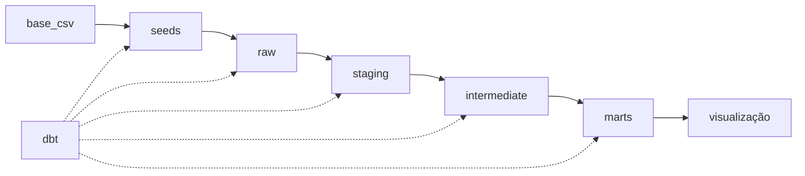

# dbt_Student_Performance_Dataset 🧙‍♂️

Este projeto tem como objetivo demonstrar o uso do `dbt` para a criação de um modelo para análise de dados de desempenho de estudantes em exames.

## Configuração do ambiente

Para executar o projeto, é necessário ter o `dbt` instalado. Para isso, basta seguir as instruções de instalação disponíveis na [documentação oficial](https://docs.getdbt.com/dbt-cli/installation).

## Execução do projeto

Para executar o projeto, basta executar o comando `dbt run` no diretório raiz do projeto.

## Documentação

- [Escopo de Negócio](/documentacao/escopo_negocio.md)

- Estrutura do Modelo: 

- Estrutura da Base de Dados:
    - **student-mat.csv:** Esta planilha contém informações sobre os estudantes relacionadas ao curso de Matemática.
    
    - **student-por.csv:** Esta planilha contém informações sobre os estudantes relacionadas ao curso de Português.

- Dicionário de Dados:
    - school: Escola do aluno.
    - sex: Sexo do aluno (ex: "F" - feminino ou "M" - masculino).
    - age: Idade do aluno.
    - address: Tipo de endereço de residência do aluno (ex: "U" - urbano ou "R" - rural).
    - famsize: Tamanho da família (ex: "LE3" - menor ou igual a 3 ou "GT3" - maior que 3).
    - Pstatus: Status de coabitação dos pais (ex: "T" - vivendo juntos ou "A" - separados).
    - Medu: Nível de educação da mãe (0 - nenhum, 1 - educação primária, 2 – 5º a 9º ano, 3 – ensino médio ou 4 – ensino superior).
    - Fedu: Nível de educação do pai (mesma escala que Medu).
    - Mjob: Trabalho da mãe (ex: "teacher", "health", "services", "at_home", "other").
    - Fjob: Trabalho do pai (mesma categorização que Mjob).
    - reason: Razão para escolher a escola (ex: "home" - próximo de casa, "reputation" - reputação da escola, "course" - preferência de curso, "other" - outro motivo).
    - guardian: Guardião do aluno (ex: "mother", "father", "other").
    - traveltime: Tempo de viagem de casa para a escola (1 - <15 min., 2 - 15 a 30 min., 3 - 30 min. a 1 hora, 4 - >1 hora).
    - studytime: Tempo semanal de estudo (1 - <2 horas, 2 - 2 a 5 horas, 3 - 5 a 10 horas, 4 - >10 horas).
    - failures: Número de reprovações passadas (n se 1<=n<3, caso contrário 4).
    - schoolsup: Suporte educacional extra (ex: "yes" ou "no").
    - famsup: Suporte educacional da família (ex: "yes" ou "no").
    - paid: Aulas particulares pagas (ex: "yes" ou "no").
    activities: Atividades extracurriculares (ex: "yes" ou "no").
    - nursery: Frequentou creche (ex: "yes" ou "no").
    - higher: Deseja cursar ensino superior (ex: "yes" ou "no").
    - internet: Acesso à Internet em casa (ex: "yes" ou "no").
    - romantic: Em um relacionamento romântico (ex: "yes" ou "no").
    - famrel: Qualidade das relações familiares (1 - muito ruim a 5 - excelente).
    - freetime: Tempo livre após a escola (1 - muito baixo a 5 - muito alto).
    - goout: Sair com amigos (1 - muito raro a 5 - muito frequente).
    - Dalc: Consumo de álcool em dias de semana (1 - muito baixo a 5 - muito alto).
    - Walc: Consumo de álcool nos fins de semana (1 - muito baixo a 5 - muito alto).
    - health: Estado de saúde atual (1 - muito ruim a 5 - muito bom).
    - absences: Número de ausências escolares.
    - G1: Nota do primeiro período (numérico: de 0 a 20).
    - G2: Nota do segundo período (numérico: de 0 a 20).
    - G3: Nota final (numérico: de 0 a 20, output target).

Selo:

