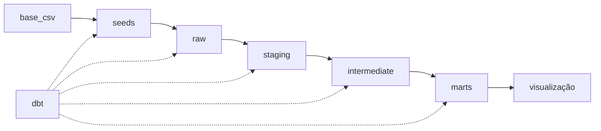

# dbt_Student_Performance_Dataset 🧙‍♂️

Este projeto tem como objetivo demonstrar o uso do `dbt` para a criação de um modelo para análise de dados de desempenho de estudantes em exames.

## Configuração do ambiente

Para executar o projeto, é necessário ter o `dbt` instalado. Para isso, basta seguir as instruções de instalação disponíveis na [documentação oficial](https://docs.getdbt.com/dbt-cli/installation).

## Execução do projeto

Para executar o projeto, basta executar o comando `dbt run` no diretório raiz do projeto.

## Documentação

- [Escopo de Negócio](/documentacao/escopo_negocio.md)

- Estrutura do Modelo: 

Selo:

